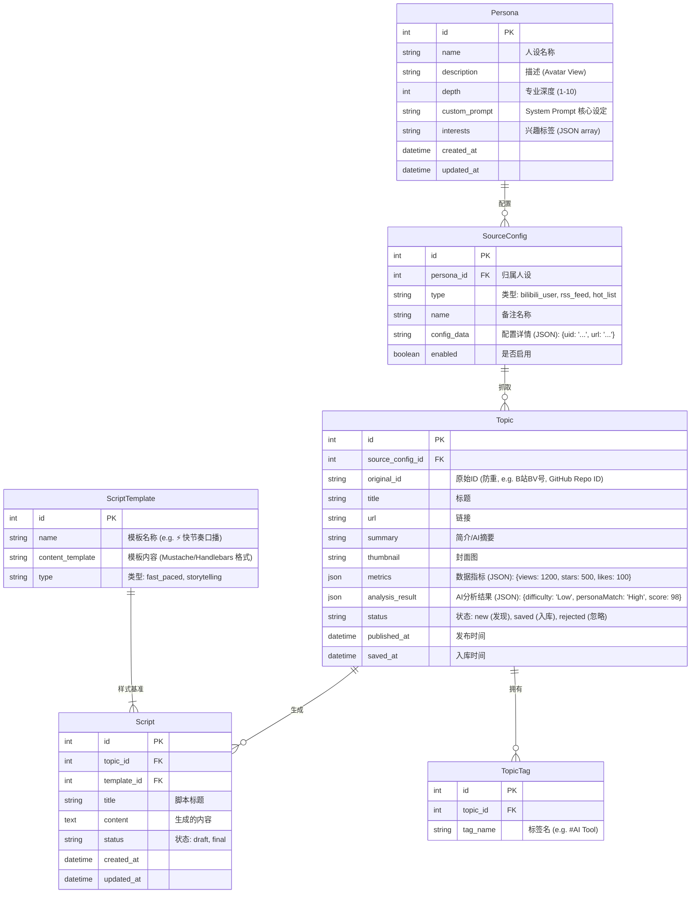

# Buddy 系统 MVP - 数据模型与 API 设计

## 目标描述
设计 "Buddy 探针选题系统" (MVP 版) 的核心数据模型和 API 接口。系统旨在为内容创作者自动化发现选题、基于人设筛选选题并生成脚本。

## 数据模型设计

### ER 图 (实体关系图)

### Schema 定义 (对应前端交互)

#### 1. Persona (人设)
*   **id**: `int`
*   **name**: `str`
*   **description**: `str`
*   **depth**: `int` (1-10)
*   **customPrompt**: `text`
*   **interests**: `list[str]`
*   **bilibiliList**: `list[SourceConfig]` (前端特定字段，映射到 SourceConfig)
*   **rssList**: `list[SourceConfig]`
*   **hotSources**: `list[SourceConfig]`

#### 2. SourceConfig (源配置)
*   **id**: `int` (可选, 新增时无)
*   **name**: `str`
*   **type**: `enum` (bilibili, rss, hot)
*   **uid**: `str` (对应 Bilibili)
*   **url**: `str` (对应 RSS)
*   **enabled**: `bool`

#### 3. Topic (选题)
*   **id**: `int`
*   **title**: `str`
*   **source**: `str` (来源平台标识，如 'GitHub', 'Bilibili')
*   **url**: `str`
*   **summary**: `text` (AI Analysis Summary)
*   **score**: `float` (匹配度分数)
*   **labels**: `list[str]` (前端用 labels, 对应 Tags)
*   **analysis**: `dict` (JSON)
    *   `difficulty`: `str`
    *   `personaMatch`: `str`
    *   `viralityPotential`: `str`
    *   `commercialValue`: `str`
*   **status**: `enum` (new, saved)

#### 4. ScriptTemplate (脚本模板)
*   **id**: `int`
*   **name**: `str`
*   **template**: `text` (Markdown string with placeholders like `{{topic.title}}`)

---

## API 接口设计 (RESTful)

### 1. 人设与配置 (Personas & Settings)
对应前端 `personaService.js` 与 `SettingsView.vue`
*   `GET /api/v1/personas`: 获取所有人设列表 (包含基础信息)。
*   `GET /api/v1/personas/{id}`: 获取单个人设详情 (包含 `bilibiliList`, `rssList` 等源配置)。
*   `POST /api/v1/personas`: 创建人设。
*   `PUT /api/v1/personas/{id}`: 更新人设 (包含更新其绑定的源配置)。
*   `DELETE /api/v1/personas/{id}`: 删除人设。

### 2. 仪表盘与发现 (Dashboard & Discovery)
对应前端 `DashboardView.vue`
*   `GET /api/v1/dashboard/feed`: 获取聚合的信息流 (Discovery)。
    *   **Query Params**:
        *   `persona_id`: `int` (必填，根据人设配置的源抓取/筛选)
        *   `type`: `xml` (可选，筛选特定类型的源，如 'github', 'bilibili')
    *   **Response**: 返回混合列表，包含 `Topic` 结构的数据 (状态为 `new`)。包含 `metrics` (stars, views) 和初步 AI 摘要。

### 3. 选题库管理 (Topic Library)
对应前端 `topicService.js` 与 `TopicLibraryView.vue`
*   `GET /api/v1/topics`: 获取**已保存**的选题列表 (Library)。
    *   支持分页，按 `saved_at` 排序。
*   `POST /api/v1/topics`: **保存/收藏**选题 (Save to Library)。
    *   Payload: `{ title, source, url, summary, originalId, analysis: {...} }`
*   `GET /api/v1/topics/{id}`: 获取选题详情 (包含完整 AI 分析报告)。
*   `DELETE /api/v1/topics/{id}`: 移除选题。
*   `POST /api/v1/topics/batch-delete`: 批量删除。
    *   Payload: `{ ids: [1, 2, 3] }`

### 4. 脚本模板 (Script Templates)
对应前端 `scriptService.js`
*   `GET /api/v1/script-templates`: 获取所有可用模板。
*   `POST /api/v1/script-templates`: 创建新模板。
*   `PUT /api/v1/script-templates/{id}`: 更新模板。
*   `DELETE /api/v1/script-templates/{id}`: 删除模板。

### 5. 脚本生成 (Script Generation)
对应前端 `TopicDetailView.vue` (功能)
*   `POST /api/v1/topics/{id}/generate-script`: 生成脚本。
    *   Payload: `{ template_id: int }`
    *   Response: `{ content: "..." }` (返回生成的 Markdown 内容)
    *   *注: 前端目前是 Mock 的 setTimeout，后端需对接 LLM。*

### 6. 外部集成 (Integration)
*   `POST /api/v1/integration/feishu/sync`: 同步到飞书多维表格。
    *   Payload: `{ topic_id: int, content: str }`

## 开发核对清单 (Checklist)

### 前端已实现 (Frontend Mocked)
- [x] SettingsView: 人设增删改查、源配置 (B站/RSS/热榜) 嵌套管理。
- [x] DashboardView: 展示发现页信息流 (UI 卡片: CodeMineCard, RivalCard, BuzzList)。
- [x] TopicLibraryView: 已保存选题的列表展示。
- [x] TopicDetailView: 选题详情展示、AI 分析维度 (`difficulty`, `match`)、脚本生成触发。
- [x] ScriptTemplates: (Service 定义了 CRUD，View 需确认是否完整)。

### 后端需适配 (Backend TODO)
- [ ] **API**: 实现 `/dashboard/feed` 接口，这是最核心的“探针”逻辑，需要实时或定时聚合 SourceConfig 中的数据源。
- [ ] **Worker**: 编写爬虫/API 客户端 (GitHub API, Bilibili API, RSS Parser)。
- [ ] **AI Engine**: 实现 `Topic` 的 `analysis` 生成 (Difficulty, Match Score) 和 `Script` 生成逻辑。
- [ ] **Database**: 迁移上述 ER 图到数据库 (SQLite/PostgreSQL)。
