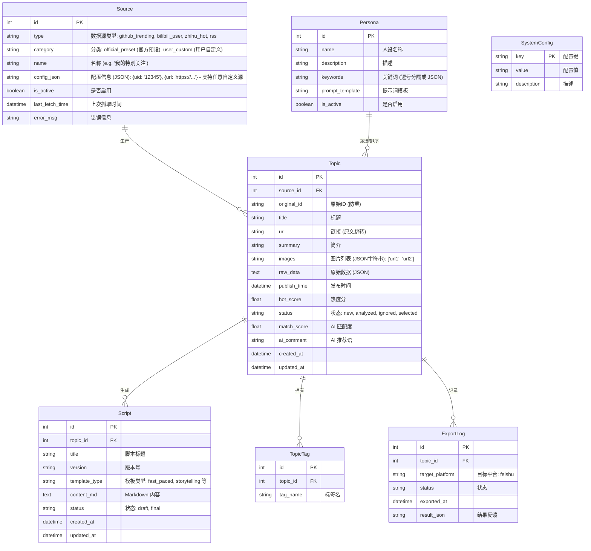

# Buddy 系统 MVP - 数据模型与 API 设计

## 目标描述
设计 "Buddy 探针选题系统" (MVP 版) 的核心数据模型和 API 接口。系统旨在为内容创作者自动化发现选题、基于人设筛选选题并生成脚本。

## 数据模型设计

### ER 图 (实体关系图)

### Schema 定义 (SQLModel/Pydantic 风格)

#### 1. Source (情报来源)
*   **id**: `int` (主键)
*   **type**: `enum` (github, bilibili, rss, hotAPI)
*   **name**: `str`
*   **config**: `dict` (JSON: `{uid: "123"}`, `{url: "..."}`) - **核心**: 存储用户自定义的 RSS URL 或 B站 UID
*   **status**: `bool` (启用/禁用)
*   **cron_expression**: `str` (可选, 定时任务表达式)

#### 2. Persona (用户人设)
*   **id**: `int`
*   **name**: `str` (例如: "技术极客", "职场导师")
*   **role_definition**: `text` (System Prompt 上下文)
*   **negative_keywords**: `list[str]` (过滤词)
*   **preferred_topics**: `list[str]` (偏好主题)

#### 3. Topic (选题候选)
*   **id**: `int`
*   **source_id**: `int` (外键)
*   **external_id**: `str` (来源方唯一 ID, 防止重复抓取)
*   **title**: `str`
*   **url**: `str` (原文链接)
*   **images**: `list[str]` (图片/封面图 URL 列表) - **新增**: 支持富媒体展示
*   **content_summary**: `text` (简短描述)
*   **meta_data**: `dict` (JSON: 播放量, Star 数, 作者信息等)
*   **ai_analysis**: `dict` (JSON: `{relevance: 0.9, reason: "...", tags: []}`)
*   **processing_status**: `enum` (pending 待处理, processed 已分析, rejected 已拒绝, approved 已采纳)

#### 4. Script (生成脚本)
*   **id**: `int`
*   **topic_id**: `int`
*   **template_id**: `str` (使用的模板 ID)
*   **content**: `text` (Markdown 格式脚本内容)
*   **iterations**: `int` (迭代版本次数)

## API 接口设计 (RESTful)

### 1. 仪表盘 & 通用 (Dashboard & General)
*   `GET /api/v1/dashboard/stats`: 获取概览数据 (总选题数, 今日新增, 已生成脚本数)。
*   `GET /api/v1/system/config`: 获取系统配置。
*   `PUT /api/v1/system/config`: 更新系统配置。

### 2. 数据源管理 (Sources)
*   `GET /api/v1/sources`: 列出所有配置的数据源 (包含预设和自定义)。
*   `POST /api/v1/sources`: **添加自定义数据源** (用户输入 RSS 链接或 UP 主 ID)。
*   `PUT /api/v1/sources/{id}`: 更新数据源信息。
*   `DELETE /api/v1/sources/{id}`: 删除/禁用数据源。
*   `POST /api/v1/sources/{id}/test`: 测试数据源连通性。
*   `POST /api/v1/tasks/trigger`: 手动触发抓取任务 (全局或指定源)。

### 3. 人设配置 (Personas)
*   `GET /api/v1/personas`: 获取人设列表。
*   `POST /api/v1/personas`: 创建新人设。
*   `PUT /api/v1/personas/{id}`: 更新人设。

### 4. 选题管理 (Topics)
*   `GET /api/v1/topics`: 获取选题列表 (支持分页, 状态/来源/日期筛选)。
*   `GET /api/v1/topics/{id}`: 获取选题详情。
*   `POST /api/v1/topics/{id}/analyze`: 手动触发/重新触发 AI 分析。
*   `PATCH /api/v1/topics/{id}/status`: 更新选题状态 (例如: 忽略/归档)。

### 5. 脚本生成 (Scripts)
*   `POST /api/v1/scripts/generate`: 为指定选题生成脚本。
    *   请求体: `{topic_id: int, template_id: str, extra_instructions: str}`
*   `GET /api/v1/scripts/{id}`: 获取脚本内容。
*   `PUT /api/v1/scripts/{id}`: 手动更新脚本内容。

### 6. 外部集成 (Integration)
*   `POST /api/v1/export/feishu`: 推送选题/脚本到飞书。
    *   请求体: `{topic_id: int, script_id: optional[int]}`

## 验证计划
### 手动验证
1.  **Schema 检查**: 对照 PRD 需求审查 ER 图和字段定义，确保 metadata 包含核心指标（如 GitHub Star 数，B 站播放量）。
2.  **API 流程走查**:
    *   模拟用户路径: 添加数据源 -> 触发抓取 -> 查看选题列表 -> AI 分析 -> 生成脚本 -> 导出。
    *   确认每个步骤都有对应的 API 接口支持。
